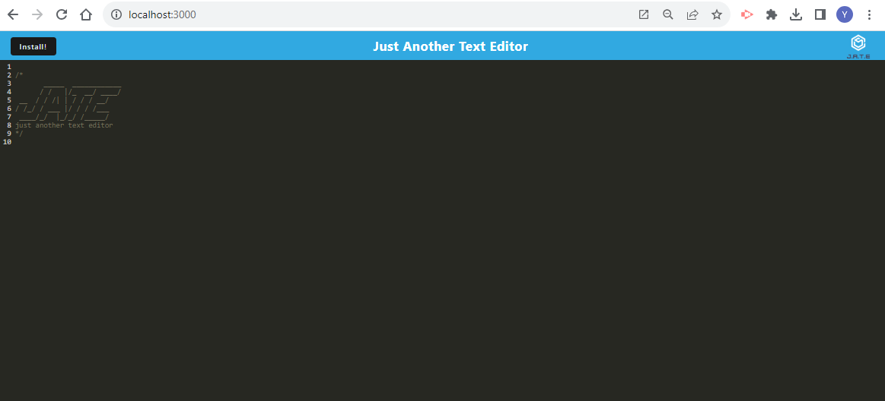

# Text-Editor
An application that allows the user to write notes to a saved browser or downloaded application. The notes will stay saved until deleted by the user.

## Motivation
There is no question of the convenience of having an app that gives you the ability to take, track, and keep notes on your personal device. Whether it is a grocery store list, things you need to get done at work, a cool quote you heard and don't want to forget, or a couple of ideas you happen to have while out and about, a note taking app will aid you in all of your ventures and ensure all of that stuff rambling around in your head has a tangible place to be stored at your convenience.

## Technologies
Node.js
JavaScript
Express
Web-Pack
Babel

## Installation
To run this project, pull it from Github to your local machine using your terminal. Make sure you have all dependencies installed, then run the express server and click on the localhost url in the command line to open it up in the browser.

Steps:
Open Github
Navigate to the 'yasminetsu/Text-Editor/' repository.
Click the green button on the page that says "code."
Copy the link under SSH.
Open your terminal and type the following keys.

$ cd <any folder you want this repository to go to>
$ git clone <paste the copied link>

